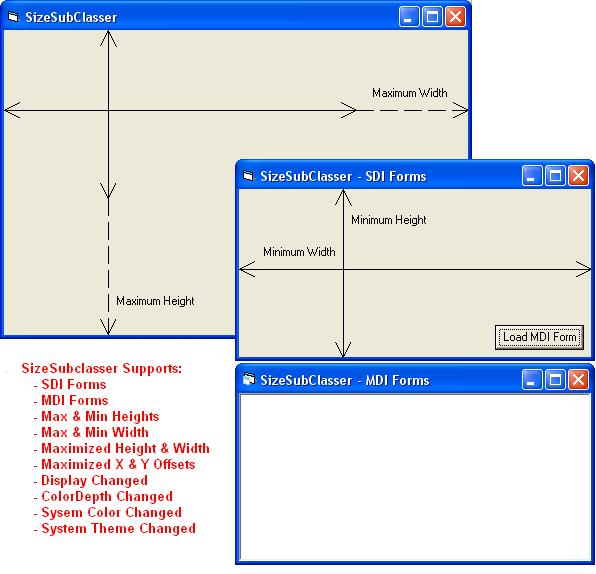



## SizeSubclasser

### Description

Need a drop in place control to provide flicker free form subclassing that can monitor form size, form move, theme changes, system color changes, and display resolution changes, then give this control a try. Simply drop this control on your form, set the properties and that is it&#8230;no extra modules, no external dependencies, just this little control! This control not only does this, but prevents additional instances of itself to prevent nasty GPF&#8217;s. Huge thanks to Paul Caton for his self-subclassing templates and examples. This project simply pulls these ideas together in a neat little package, and I simply added a few additional events that might be handy for the developer&#8230;.enjoy!
 
### More Info
 

             |
---                |---
**Submitted On**   |2005-07-13 08:11:42
**By**             |[TerriTop](https://github.com/Planet-Source-Code/PSCIndex/blob/master/ByAuthor/territop.md)
**Level**          |Intermediate
**User Rating**    |5.0 (55 globes from 11 users)
**Compatibility**  |VB 6\.0
**Category**       |[Custom Controls/ Forms/  Menus](https://github.com/Planet-Source-Code/PSCIndex/blob/master/ByCategory/custom-controls-forms-menus__1-4.md)
**World**          |[Visual Basic](https://github.com/Planet-Source-Code/PSCIndex/blob/master/ByWorld/visual-basic.md)
**Archive File**   |[SizeSubcla1912787132005\.zip](https://github.com/Planet-Source-Code/territop-sizesubclasser__1-61676/archive/master.zip)

